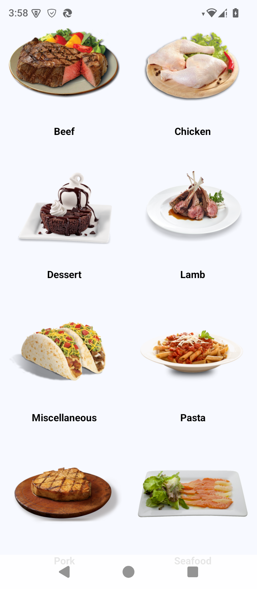

# Meals App

## Description

This is a simple Android meals app built using **Kotlin** and **Jetpack Compose**.
It displays a list of meals in a two-column grid layout, with each meal item showing an image of the meal and its name below it. The app provides a clean and visually appealing way to browse meals.

## Features

- **Two-Column Grid**: Displays meals in a responsive two-column layout.
- **Meal Display**: Each meal item includes an image and its name.
- **Intuitive UI**: Built with Jetpack Compose for a modern, fluid interface.
- **Responsive Design**: Adapts to various screen sizes and orientations.

## Screenshots

For a visual overview, check the screenshot above or explore the app in the emulator/device.

## Installation

1. Clone or download this repository.
2. Open the project in **Android Studio**.
3. Ensure you have the latest **Android SDK** and **Jetpack Compose** dependencies.
4. Build and run the app on an Android device or emulator .

## How to Use

1. Open the app to view the list of meals.
2. Browse the meals displayed in a two-column grid.
3. Each meal item shows its image with the name below it.

## Tech Stack

- **Language**: Kotlin
- **UI Framework**: Jetpack Compose
- **Build Tool**: Gradle
